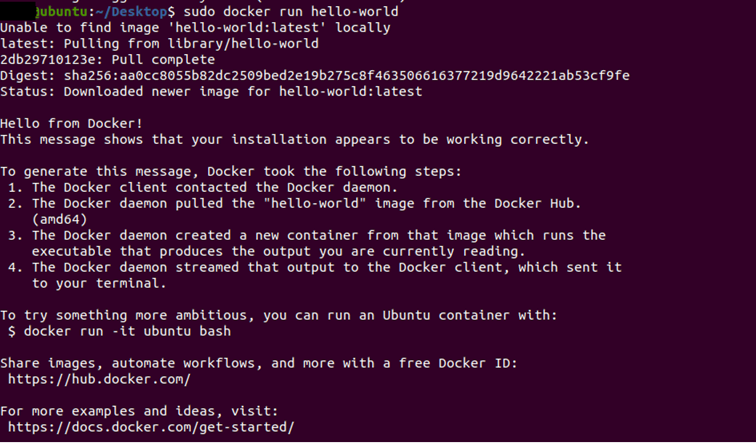

Install HORNET using Docker

This guide represents the recommended setup to run a HORNET node. It includes everything required to setup a public node

------------------------------------------------------------------------------------------------------------------------
**Requirements**
1. A recent release of Docker enterprise or community edition. Avoid using the Docker version shipped with your OS since
these are mostly out of date. You can find installation instructions in the official Docker documentation.
2. Docker Compose CLI plugin.
3. A registered domain name pointing to the public IP address of your server. (optional if not using HTTPS)
4. Opening up the following ports in your servers firewall:
    - 15600 TCP - Used for HORNET gossip.
    - 14626 UDP - Used for HORNET autopeering.
    - 80 TCP - Used for HTTP. (can be changed, see below)
    - 443 TCP - Used for HTTPS. (optional if not using HTTPS)
    - 4000 TCP/UDP - Used for Wasp gossip. (optional if not using Wasp)
5. curl.
------------------------------------------------------------------------------------------------------------------------
------------------------------------------------------------------------------------------------------------------------
**How to install DOCKER**

**Step 1. Prepare the system**
The first step is to update your operating system to the most recent version, something that is quickly achieved with two commands:

_sudo apt-get update
sudo apt-get upgrade_

**Step 2. Remove any traces of Docker**
If you have already used any beta versions of Docker or installed a preview of this virtualization software, you will 
need to remove them before you can install Docker. Otherwise, unwanted side effects may occur.

_sudo apt remove docker-desktop
rm -r $HOME/.docker/desktop
sudo rm /usr/local/bin/com.docker.cli
sudo apt purge docker-desktop_

**Step 3. Download Docker repository**
Docker uses a repository in its installation that you must store on your system. In order to work with this repository, 
you must first install the following packages:

_sudo apt-get install \
    ca-certificates \
    curl \
    gnupg \
    lsb-release_

Next, you can add the Docker GPG key to your system:

_sudo mkdir -p /etc/apt/keyrings
curl -fsSL https://download.docker.com/linux/ubuntu/gpg | sudo gpg --dearmor -o /etc/apt/keyrings/docker.gpg_

The Docker repository is also configured on the command line. To do this, it is also enough to apply the appropriate 
terminal command:

_echo \
    "deb [arch=$(dpkg --print-architecture) signed-by=/etc/apt/keyrings/docker.gpg] https://download.docker.com/linux/ubuntu \
    $(lsb_release -cs) stable" | sudo tee /etc/apt/sources.list.d/docker.list > /dev/null_

**Step 4. Install Docker Engine**
In Ubuntu 22.04 you can also download the Docker engine directly from the terminal. The specific commands you need to do
this depend on whether you want to download a specific version of Docker or whether you prefer to opt for the most 
recent version.
To download a specific version of Docker you can use the following command to see a list of all available versions:

_apt-cache madison docker-ce | awk '{ print $3 }'_

You can choose one of the versions that appear in the list. Indicate which one you want with the version string. 
Then, install it with the following:

_VERSION_STRING=5:20.10.13~3-0~ubuntu-jammy
sudo apt-get install docker-ce=$VERSION_STRING docker-ce-cli=$VERSION_STRING containerd.io docker-compose-plugin_

**Step 5. Check the installation**
To check if the program has been installed correctly, Docker allows you to start a “Hello World” Docker container. 
Do it with the following terminal command:

_sudo docker run hello-world_

If everything went well, the following screen will appear on your command line:

------------------------------------------------------------------------------------------------------------------------

